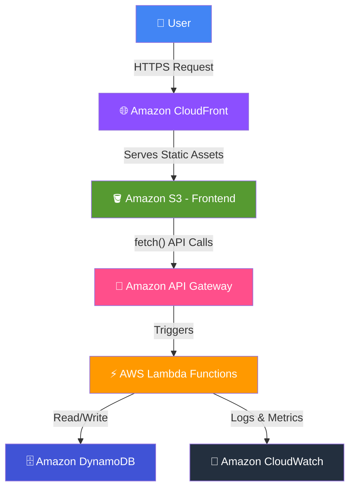
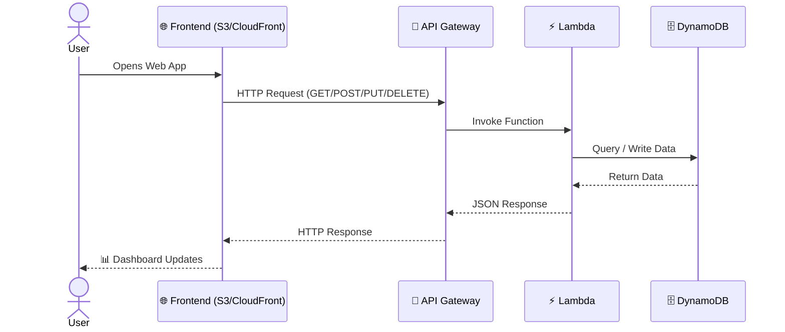

<div align="center">

# 💰 Serverless Expense Tracker

### A Full-Stack, 100% Serverless Expense Management Application Built on AWS

*Track. Analyze. Manage. All without a single server.*

[](https://aws.amazon.com/)
[](https://aws.amazon.com/serverless/)
[](LICENSE)
[](http://makeapullrequest.com)

[](#)
[](#)
[](#)
[](#)
[](#)
[](#)
[](#)
[](#)
[](#)

[Overview](#-project-overview) •
[Features](#-frontend-features) •
[Architecture](#-project-architecture) •
[Deployment](#-how-to-deploy) •
[Roadmap](#-future-improvements) •
[License](#-license)

</div>

---

## 📖 Project Overview

**Serverless Expense Tracker** is a fully serverless, full-stack web application that helps users track, manage, and analyze their personal expenses — with **zero server management**.

Built entirely on **AWS managed services**, the application scales automatically, costs pennies to run at low traffic, and requires no infrastructure maintenance.

### ✨ What can users do?

| | | |
|---|---|---|
| ➕ Add expenses | 📋 View all expenses | ✏️ Update existing expenses |
| 🗑️ Delete individual expenses | 🧹 Delete all expenses | 📊 View dashboard statistics |
| 📈 View analytics charts | 🔍 Filter expenses | 🌙 Use dark mode |
| 📱 Responsive UI (desktop & mobile) | | |

The **frontend** is hosted on **Amazon S3** and delivered globally over **HTTPS** via **Amazon CloudFront**. The **backend** is powered by **API Gateway + AWS Lambda**, with all expense data persisted in **Amazon DynamoDB**.

> 💡 No EC2. No containers. No servers to patch. Just pure serverless architecture.

---

## ☁️ AWS Services Used

<table>
<tr>
<td valign="top" width="25%">

### 🖥️ Frontend
- Amazon S3
- Amazon CloudFront

</td>
<td valign="top" width="25%">

### ⚙️ Backend
- Amazon API Gateway (HTTP API)
- AWS Lambda
- Amazon DynamoDB

</td>
<td valign="top" width="25%">

### 📡 Monitoring
- Amazon CloudWatch

</td>
<td valign="top" width="25%">

### 🔒 Security
- IAM Roles
- IAM Policies
- CORS Configuration

</td>
</tr>
</table>

---

## 🧩 Lambda Functions

| # | Function Name | Responsibility |
|---|----------------|-----------------|
| 1️⃣ | `AddExpense` | Adds a new expense record into DynamoDB |
| 2️⃣ | `GetExpenses` | Retrieves all expense records |
| 3️⃣ | `UpdateExpense` | Updates an existing expense record |
| 4️⃣ | `DeleteExpense` | Deletes a single expense by ID |
| 5️⃣ | `ClearAllExpenses` | Deletes every expense from the table |

---

## 🔌 API Routes

| Method | Route | Lambda Triggered | Description |
|:------:|-------|-------------------|--------------|
| `POST` | `/expense` | `AddExpense` | Creates a new expense entry in DynamoDB |
| `GET` | `/expense` | `GetExpenses` | Fetches all stored expense records |
| `PUT` | `/expense` | `UpdateExpense` | Updates fields of an existing expense |
| `DELETE` | `/expense` | `DeleteExpense` | Removes a single expense by `expenseId` |
| `DELETE` | `/expenses/all` | `ClearAllExpenses` | Wipes all records from the table |

<details>
<summary>📥 Sample Request / Response Payloads</summary>

**POST `/expense`**
```json
{
  "title": "Grocery Shopping",
  "amount": 54.20,
  "category": "Food",
  "date": "2026-07-10",
  "month": "July",
  "notes": "Weekly groceries"
}
```

**GET `/expense` Response**
```json
[
  {
    "expenseId": "a1b2c3d4",
    "title": "Grocery Shopping",
    "amount": 54.20,
    "category": "Food",
    "date": "2026-07-10",
    "month": "July",
    "notes": "Weekly groceries"
  }
]
```

</details>

---

## 🗄️ Database

### DynamoDB Table: `Expenses`

| Attribute | Type | Key |
|-----------|------|-----|
| `expenseId` | String | 🔑 Partition Key |
| `title` | String | — |
| `amount` | Number | — |
| `category` | String | — |
| `date` | String | — |
| `month` | String | — |
| `notes` | String | — |

> 🔧 DynamoDB is provisioned in **on-demand capacity mode**, so it automatically scales with traffic and you only pay per request.

---

## 🎨 Frontend Features

<details open>
<summary><b>📊 Dashboard</b></summary>
<br>

- Total Expenses
- Monthly Expenses
- Highest Category
- Total Transactions
- Recent Activity

</details>

<details>
<summary><b>💵 Expenses Page</b></summary>
<br>

- Add Expense Form
- Edit Expense
- Delete Expense
- Search
- Category Filter
- Notes Field

</details>

<details>
<summary><b>📈 Analytics</b></summary>
<br>

- Monthly Summary
- Category Pie Chart
- Monthly Bar Chart

</details>

<details>
<summary><b>⚙️ Settings</b></summary>
<br>

- Export CSV
- Theme Toggle (Light/Dark)
- About Project

</details>

---

## 🏗️ Project Architecture



### 🔄 Request Sequence Diagram



---

## ⚙️ Workflow

### 📥 Load Expenses (GET)

```
User opens website
        ↓
CloudFront serves static website (HTTPS)
        ↓
Frontend (index.html/app.js) loads in browser
        ↓
Frontend calls GET /expense
        ↓
API Gateway invokes GetExpenses Lambda
        ↓
Lambda scans the DynamoDB Expenses table
        ↓
DynamoDB returns all items
        ↓
Lambda formats and returns JSON
        ↓
Frontend renders data → Dashboard & Expenses list update
```

### ➕ Add Expense (POST)

```
User fills "Add Expense" form and submits
        ↓
Frontend sends POST /expense with expense JSON body
        ↓
API Gateway invokes AddExpense Lambda
        ↓
Lambda generates a unique expenseId (UUID)
        ↓
Lambda writes the new item into DynamoDB
        ↓
DynamoDB confirms write
        ↓
Lambda returns success response
        ↓
Frontend refreshes expense list & dashboard totals
```

### ✏️ Update Expense (PUT)

```
User clicks "Edit" on an expense and modifies fields
        ↓
Frontend sends PUT /expense with expenseId + updated fields
        ↓
API Gateway invokes UpdateExpense Lambda
        ↓
Lambda runs an UpdateItem operation on DynamoDB
        ↓
DynamoDB updates the matching record
        ↓
Lambda returns the updated item
        ↓
Frontend re-renders the updated expense card
```

### 🗑️ Delete Expense (DELETE)

```
User clicks "Delete" on a single expense
        ↓
Frontend sends DELETE /expense with expenseId
        ↓
API Gateway invokes DeleteExpense Lambda
        ↓
Lambda deletes the matching item from DynamoDB
        ↓
Lambda returns success confirmation
        ↓
Frontend removes the item from the UI instantly
```

### 🧹 Clear All Expenses (DELETE /expenses/all)

```
User clicks "Clear All" in Settings
        ↓
Frontend shows confirmation prompt
        ↓
Frontend sends DELETE /expenses/all
        ↓
API Gateway invokes ClearAllExpenses Lambda
        ↓
Lambda scans the table and batch-deletes every item
        ↓
DynamoDB table is emptied
        ↓
Frontend resets Dashboard, Analytics, and Expense list to 0
```

---

## 🛠️ Tech Stack

<table>
<tr>
<td valign="top">

**Frontend**
- HTML5
- CSS3
- JavaScript (Vanilla)

</td>
<td valign="top">

**Backend**
- AWS Lambda (Python)
- Amazon API Gateway

</td>
<td valign="top">

**Database**
- Amazon DynamoDB

</td>
<td valign="top">

**Hosting**
- Amazon S3
- Amazon CloudFront

</td>
<td valign="top">

**Monitoring**
- Amazon CloudWatch

</td>
</tr>
</table>

---

## 📁 Project Structure

```
Expense-Tracker/
│
├── index.html
├── style.css
├── app.js
├── assets/
├── README.md
│
└── lambda/
    ├── AddExpense.py
    ├── GetExpenses.py
    ├── UpdateExpense.py
    ├── DeleteExpense.py
    └── ClearAllExpenses.py
```

---

## 🚀 How to Deploy

<details open>
<summary><b>Step-by-step deployment guide (click to expand/collapse)</b></summary>

### 1️⃣ Create the DynamoDB Table
- Go to **DynamoDB Console** → **Create table**
- Table name: `Expenses`
- Partition key: `expenseId` (String)
- Capacity mode: On-demand

### 2️⃣ Create the Lambda Functions
- Go to **Lambda Console** → **Create function** (repeat for all 5 functions)
- Runtime: **Python 3.12**
- Upload the corresponding `.py` file from the `lambda/` folder
- Set environment variable `TABLE_NAME=Expenses`

### 3️⃣ Attach IAM Policies
- Create an IAM role: `ExpenseTrackerLambdaRole`
- Attach a policy granting `dynamodb:PutItem`, `GetItem`, `Scan`, `UpdateItem`, `DeleteItem`, `BatchWriteItem` on the `Expenses` table
- Attach `AWSLambdaBasicExecutionRole` for CloudWatch logging
- Assign this role to each Lambda function

### 4️⃣ Create API Gateway Routes
- Go to **API Gateway Console** → **Create API** → **HTTP API**
- Create routes: `POST /expense`, `GET /expense`, `PUT /expense`, `DELETE /expense`, `DELETE /expenses/all`
- Attach each route to its corresponding Lambda integration

### 5️⃣ Enable CORS
- In API Gateway → **CORS Configuration**
- Allow origin: your CloudFront domain (or `*` for testing)
- Allow methods: `GET, POST, PUT, DELETE, OPTIONS`
- Allow headers: `Content-Type`

### 6️⃣ Deploy the API
- Create a **stage** (e.g. `prod`)
- Deploy the API and note the **Invoke URL**
- Update `app.js` with this base API URL

### 7️⃣ Upload Frontend to S3
- Create an S3 bucket (e.g. `expense-tracker-frontend`)
- Upload `index.html`, `style.css`, `app.js`, and `assets/`
- Block all public access **except** via CloudFront (recommended) or enable static hosting directly

### 8️⃣ Configure Static Website Hosting
- In the S3 bucket → **Properties** → **Static website hosting** → Enable
- Set `index.html` as the index document

### 9️⃣ Configure CloudFront
- Create a CloudFront distribution
- Origin: your S3 bucket (use Origin Access Control for security)
- Enable **HTTPS only** (redirect HTTP → HTTPS)
- Set default root object: `index.html`

### 🔟 Test the Application
- Open the CloudFront domain URL in your browser
- Add, view, edit, delete, and clear expenses
- Confirm dashboard and analytics update correctly

</details>

---

## ✅ Features Table

| Feature | Status |
|---------|:------:|
| Add Expense | ✅ |
| Update Expense | ✅ |
| Delete Expense | ✅ |
| Clear All | ✅ |
| Analytics | ✅ |
| Dashboard | ✅ |
| Dark Mode | ✅ |
| Responsive UI | ✅ |
| CloudFront HTTPS | ✅ |
| Serverless Architecture | ✅ |
| CSV Export | ✅ |

---

## 🔗 AWS Communication Explained

```
Browser
   ↓
CloudFront   → Caches & serves content globally over HTTPS
   ↓
S3            → Stores the static frontend (HTML/CSS/JS)
   ↓
JavaScript fetch()  → Frontend makes an async API call
   ↓
API Gateway   → Receives the HTTP request, validates route/method
   ↓
Lambda        → Executes business logic for that specific route
   ↓
DynamoDB      → Reads or writes the expense data
   ↓
Lambda Response → Formats the result as JSON
   ↓
API Gateway   → Returns the HTTP response to the client
   ↓
Frontend      → Receives JSON and updates the DOM
   ↓
Dashboard     → Reflects updated totals, charts, and lists
```

**Connection breakdown:**

| Step | Service A | Service B | Communication Method |
|------|-----------|-----------|------------------------|
| 1 | Browser | CloudFront | HTTPS GET request for static assets |
| 2 | CloudFront | S3 | Origin fetch (cached at edge locations) |
| 3 | Frontend JS | API Gateway | `fetch()` calls using REST/HTTP verbs |
| 4 | API Gateway | Lambda | Native AWS integration (event trigger) |
| 5 | Lambda | DynamoDB | AWS SDK (`boto3`) calls |
| 6 | Lambda | API Gateway | Returns structured JSON response |
| 7 | API Gateway | Frontend | HTTPS JSON response |
| 8 | Lambda | CloudWatch | Automatic logging & metrics |

---

## 📸 Screenshots

> Replace the placeholders below with actual screenshots once available.

<details>
<summary><b>🏠 Homepage</b></summary>

```
[ Homepage Screenshot Placeholder ]
```
</details>

<details>
<summary><b>📊 Dashboard</b></summary>

```
[ Dashboard Screenshot Placeholder ]
```
</details>

<details>
<summary><b>💵 Expenses Page</b></summary>

```
[ Expenses Page Screenshot Placeholder ]
```
</details>

<details>
<summary><b>📈 Analytics</b></summary>

```
[ Analytics Screenshot Placeholder ]
```
</details>

<details>
<summary><b>⚙️ Settings</b></summary>

```
[ Settings Screenshot Placeholder ]
```
</details>

<details>
<summary><b>🌙 Dark Mode</b></summary>

```
[ Dark Mode Screenshot Placeholder ]
```
</details>

<details>
<summary><b>🏗️ Architecture Diagram</b></summary>

```
[ Architecture Diagram Screenshot Placeholder ]
```
</details>

---

## 🔮 Future Improvements

- 🔐 **JWT Authentication** — Secure API routes with token-based auth
- 👤 **Amazon Cognito** — Full user sign-up/sign-in and identity management
- 🏷️ **Expense Categories** — Custom, user-defined categories
- 🔔 **Budget Alerts** — Notify users when nearing budget limits
- 📧 **Email Notifications** — Send summaries via Amazon SES
- 📅 **Monthly Reports** — Auto-generated PDF/email reports
- 🤖 **AI Spending Analysis** — Bedrock-powered spending insights
- 🔁 **Recurring Expenses** — Support for subscriptions & recurring bills
- 👥 **Multi-user Support** — Per-user data isolation and dashboards

---

## 📜 License

This project is licensed under the **MIT License**.

```
MIT License

Copyright (c) 2026

Permission is hereby granted, free of charge, to any person obtaining a copy
of this software and associated documentation files (the "Software"), to deal
in the Software without restriction, including without limitation the rights
to use, copy, modify, merge, publish, distribute, sublicense, and/or sell
copies of the Software, subject to the following conditions:

The above copyright notice and this permission notice shall be included in
all copies or substantial portions of the Software.

THE SOFTWARE IS PROVIDED "AS IS", WITHOUT WARRANTY OF ANY KIND, EXPRESS OR
IMPLIED, INCLUDING BUT NOT LIMITED TO THE WARRANTIES OF MERCHANTABILITY,
FITNESS FOR A PARTICULAR PURPOSE AND NONINFRINGEMENT.
```

See the [LICENSE](LICENSE) file for full details.

---

## 👨‍💻 Author

<div align="center">

**Built with ☁️ and 🐍 by a Cloud Engineer**

Passionate about serverless architecture, AWS cloud infrastructure, and building scalable applications without managing a single server.

[](#)
[](#)
[](#)

⭐ **If you found this project useful, consider giving it a star!** ⭐

</div>

---

<div align="center">

*Made with 💙 using AWS Serverless technologies*

</div>
